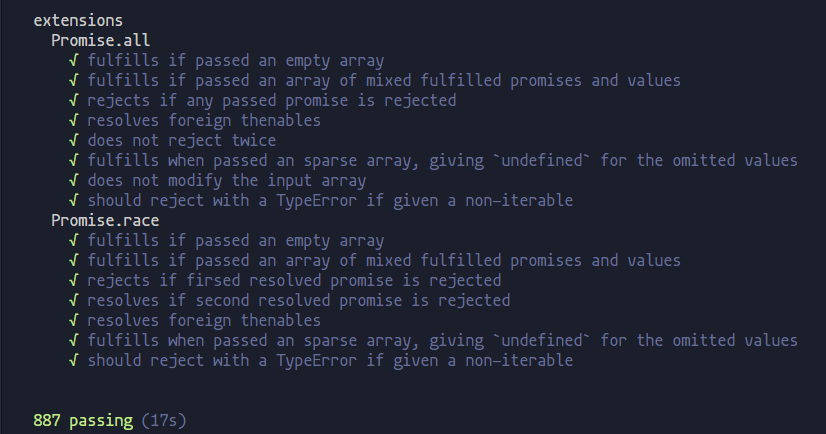

## Promise的实现

用es5和es6不同的语法糖实现Promise的polyfill。

1. [es5版本](./promise/index.es5.js)
2. [es6版本](./promise/index.es6.js)

两者实现思路一致，只是es6版本使用了一些es6的语法糖，都已经跑通Promise/A+规范的全部测试用例，用例来自于[promises-aplus-tests](https://github.com/promises-aplus/promises-tests/)

