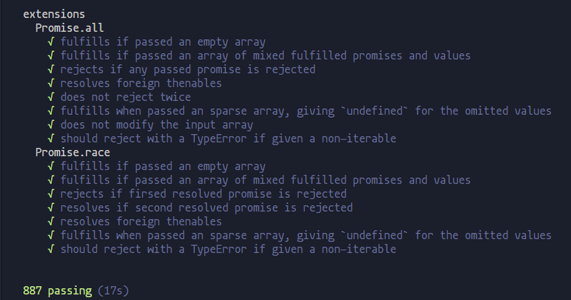

## Promise的实现

打算用es5和es6不同的语法糖实现Promise的polyfill。

es5版本已经完成，详见[es5版本](./index.es5.js)。已经跑通Promise/A+规范的全部测试用例，用例来自于[promises-aplus-tests](https://github.com/promises-aplus/promises-tests/)

> todo:用es6语法实现一次
